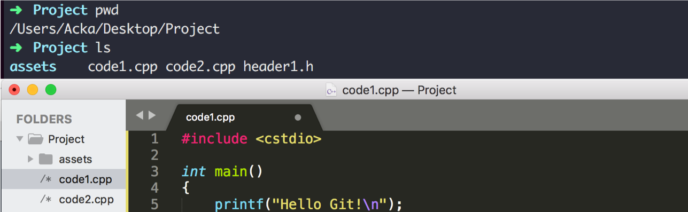
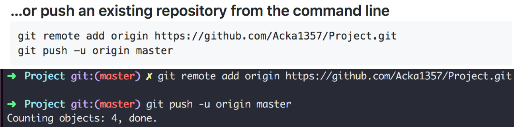
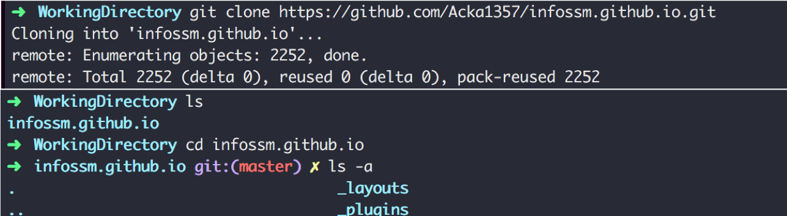

## VCS? Git? GitHub?

**Git**이란 버전 관리 시스템(VCS, Version Control System)의 한 종류입니다. 그렇다면 여기서 말하는 버전 관리란 무엇이고, 왜 필요할까요?

버전 관리란 이름 그대로 여러 파일을 하나의 버전으로 묶어 관리합니다. A라는 소스코드의 묶음이 있을 때, 이를 버전1이라는 이름으로 저장해봅시다. 이후 버전1에서 파일을 추가하거나, 삭제하거나, 수정하는 등의 작업을 거쳐 버전2라는 이름으로 저장합니다. 마찬가지로 버전2에서 버전3를 만듭니다. 아차, 그런데 버전2에서 수정한 파일 때문인지 오류가 생겼습니다. 이때 우리는 이전에 저장해둔 버전1을 불러와 다시 작업할 수 있습니다.

만약 문제가 생겼을 때 이러한 백업 정보가 없다면 어떻게 될까요? 기억을 하나하나 되짚어가며 변경점들을 찾아 복원해야 할 것입니다. 물론 그 과정은 쉽지 않겠죠. 혹은 여러분의 컴퓨터 어딘가에 project, project_final, project_real_final 등의 이름으로 존재할 백업파일을 찾아볼 수도 있습니다.

VCS 역시 프로젝트를 버전별로 관리하기 위해 백업을 필요로 합니다. 다만 프로젝트 전체를 매번 새롭게 저장하지 않고 각 버전에서 다음 버전이 만들어질 때의 변경사항만을 저장합니다. 어떤 내용이 추가/수정/삭제 되었는지 등을 로그로 남겨놓으면 그 기록을 되짚어 파일을 복구하는 것이죠. 위와 같은 상황에서는 버전2->버전3에서 발생한 변경내역을 되돌린 후 버전1->버전2로 올 때 발생한 변경내역을 되돌리면 우리는 버전1의 프로젝트로 다시 돌아올 수 있습니다.

**Git**은  이러한 VCS 중 현재 가장 널리 쓰이며, 리눅스 커널의 아버지인 리누스 토발즈가 만든 VCS의 이름입니다. 프로젝트의 버전/이력 관리를 넘어 개발협업을 위한 도구로 사용되는 Git은 로컬에 저장된 기록들을  외부 서버에 올려 환경이 바뀌더라도 원하는 시점의 프로젝트를 내려받을 수 있게 하거나, 다른 사람이 작업한 변경 내역을 합치는 등 협업을 위한 다양한 기능을 제공합니다. 

**Github**는 이러한 Git의 원격 저장소 및 프로젝트 전반의 관리 기능을 제공하고 이를 다른 사람들과 공유할 수 있는 웹 기반 솔루션 중 하나입니다.

## 어떻게 Git을 통해 변경내역을 저장하나요?

Git은 생각 이상으로 편리하지만 그만큼 처음 배울때에는 굉장히 복잡해 보일 수 있습니다(실제로 복잡합니다). Git을 이해하기 위해 알아야하는 것들은 많겠지만 처음부터 너무 완벽하게 이해할 필요도, 모든 기능을 알 수도 없습니다. 그러니 우선은 가장 중심이 되는 트랜잭션과 명령어들을 알아봅시다.

위 그림은 Git 프로젝트를 사용할 때 중심이 되는 트랜잭션을 네 가지 단계별로 나누어 나타낸 것입니다. 네모 박스로 표시된 각 단계가 의미하는 것은 아래와 같습니다.

* **Working Directory:** 현재 작업 중인 Git 프로젝트 파일들이 있는 내 PC의 디렉토리입니다.
  평소 작업하듯 자유롭게 프로젝트를 작업할 수 있습니다.
* **Staging Area:** 커밋할 변경 내역들의 대기 장소입니다. 
  'git add' 명령어를 사용하면 Working Directory의 변경내역을 Staging Area에 올립니다. 명령어 옵션을 통해 이 단계를 생략할 수 있습니다.
* **Local Repository:** 커밋들이 스냅샷으로 기록된 곳입니다.
  'git commit' 명령어를 사용하면 Staging Area에 있는 변경내역들을 실제 스냅샷으로 묶어 Local Repository에 올릴 수 있습니다. 즉, **하나의 commit이 하나의 버전**의 구분점이 되며 이전 버전에서 해당 버전으로의 변경내역이 담겨 있습니다.

지금까지의 작업은 모두 내 **로컬 환경**에서 일어납니다. 만약 포맷이나 폴더삭제 등을 통해 내 PC에 있던 git 디렉토리가 사라진다면 버전 정보 역시 잃어버리는 것이죠. 이러한 점은 파일의 사본을 백업본으로 유지하는 앞선 상황과 같습니다. 또한 다른 사람들이 내 프로젝트를 볼 수도 없죠. 이런 위험을  방지하고 다른 환경에서도 참조하기 위해서는 로컬에 있는 커밋들을 **원격 서버**에 올려야 합니다. Local Repository에 있는 커밋을 리모트 서버에 올리는 명령어가 바로 'git push' 입니다.

* **Remote Repository:** 로컬 PC를 넘어 원격 서버에서 관리되는 저장소입니다.
  이 곳에 올라온 커밋은 이제 다른 사람들도 참조 할 수 있습니다(공개된 레포지토리일 경우에만). 커밋 단위로 해당 버전의 프로젝트를 내려받는 등의 행위가 가능합니다. 외부 저장소이기 때문에 로컬 환경의 파일이 손상되더라도 외부 저장소에 올라간 기록은 따로 유지됩니다.

각 단계는 적어둔 역할뿐만 아니라 다른 유용한 기능도 포함하고 있습니다. 예를 들어 아직 커밋되지 않은 변경 내역을 모두 없던 것으로 만들어 이전 상태로 돌아갈 수도 있으며, 혹은 현재 변경 내역들을 잠시 stash하여 다른 작업을 선행한 뒤 다시 불러올 수도 있습니다. 그러나 이 모든것을 다 알고 시작하기엔 너무나 복잡하고 방대합니다. 그러니 대략적인 흐름을 먼저 이해한 후, 필요할 때에 알아보며 하나씩 익혀갑시다.

## GitHub를 통해 내 프로젝트 공유하기

사실 이렇게 글로 읽어봐야 뭐 와닿겠습니까. 그러니 실제로 프로젝트를 만들어 Git으로 관리하고, GitHub에 올려 공유해봅시다.

#### Local Repository 생성 및 관리 ####

위와 같은 **로컬 프로젝트**가 있습니다. 이미 진행된 프로젝트라면 파일들이 있을 것이고, 프로젝트의 시작부터 Git을 쓰려고 한다면 빈 폴더도 괜찮습니다. 이 프로젝트를 Git을 통해 관리하고 싶다면 우리는 Git을 위한 환경을 마련해야 합니다. (Window 환경이라면 아래 단계 이전에 Git을 먼저 설치해야 합니다.)

먼저 Git으로 관리하려는 프로젝트의 **최상위 폴더**로 가봅시다. 이후 **'git init'** 명령어를 사용하면 내 프로젝트 폴더의 바로 밑에 Local Repository를 위한 .git 디렉토리가 생성된 것을 볼 수 있습니다. 위 터미널에서는 init 이후 해당 프로젝트가 git으로 관리되고 있으며 현재 브랜치가 master임을 보여주고 있지만 사용하는 터미널에 따라 안보일 수 있으니 이는 신경 쓰지 않아도 됩니다. 브랜치에 대해서도 이번 포스트에서는 다루지 않습니다.

**'git status'** 명령어를 통해 init 직후에는 디렉토리 내의 모든 파일이 아직 Working Directory에만 있는 상태임을 확인할 수 있습니다. **'git add <**디렉토리 혹은 파일명**>'** 명령어를 통해 모든 파일을 올려줍시다.

이제 모든 파일이 Staging Area에 올라갔고, 커밋이 가능한 상태임을 확인할 수 있습니다. 이 상태 그대로 커밋을 남겨 버젼을 기록해봅시다. 명령어는 **'git commit -m "<**이번 변경내역에 대한 설명**>"'** 입니다.

커밋 이후 **'git log'** 명령어를 통해 커밋이 정상적으로 저장되었음을 확인할 수 있습니다. 위에 보이는 커밋의 해시코드는 이후 해당 버전으로 돌아오고 싶을 때, 혹은 해당 커밋의 파일을 불러오고 싶을 때 등의 상황에서 색인으로 사용됩니다. 여기까지가 Local Repository입니다. 이제 이 Local Repository의 내용을 Remote Repository에 올려 언제 어디서나 접근 및 작업이 가능하게 만들어 봅시다. 

#### Remote Repository 등록 및 관리

GitHub을 를 통해 내 프로젝트를 공유하기 위해서는 GitHub에 이를 위한 **레포지토리를 생성**해야 합니다. push를 통해 Remote Repository에 업로드한 프로젝트 현황을 보려면 이를 담고 있는 저장소에 접근할 수 있어야할 것이고 GitHub은 이를 위한 저장소 및 url을 제공합니다.

GitHub 계정을 만들고 메인페이지를 가면 여기저기에 새로운 레포지토리 생성을 위한 버튼이 보입니다. 레포지토리 이름을 입력하고(보통 최상위 폴더의 이름과 같습니다) 생성하기 버튼을 누르면 해당 레포지토리에 프로젝트를 연결하는 다양한 방법이 안내되어 있습니다. 이 중 아래와 같은 타이틀의 내용을 복사하여 실행합니다.

위 과정은 내 Local Repository와 GitHub의 Remote Repository를 연결하는 과정으로 GitHub 계정 로그인을 요구할 수 있습니다. 이후 새로고침을 하면 짜쟌- 내 깃헙 레포지토리에 로컬에 있던 프로젝트가 등록된 것을 확인할 수 있습니다.

이후에도 로컬에서 프로젝트를 관리하면서 커밋을 남기고, 이를 push하면 GitHub에 등록된 파일 역시 바뀌게 됩니다. push하기 전까지 변경 내용은 로컬에서만 유지됩니다.

## Fork와 Pull Request

자신만의 프로젝트도 좋지만 누군가 공개해 둔 프로젝트를 가져와 작업하고 싶을 때가 있습니다. 로컬에 가져와서 테스트 용도로만 사용하거나 나에게 해당 레포지토리의 관리 권한이 있다면 'git clone'을 통해 로컬로 복사해 작업하는 것으로 충분합니다. **clone**이란 원격 저장소에 있는 프로젝트를 내 로컬 환경에 복사해 오는 기능입니다.

하지만 만약 나에게 권한은 없지만 기여하고 싶은 프로젝트가 있다면 clone 이전에 먼저 해당 프로젝트를 fork해오는 작업이 필요합니다. **fork**는 다른 사람의 저장소를 가져와 내 저장소를 만드는 기능입니다.

가져오고 싶은 프로젝트의 레포지토리에서 위의 Fork 버튼을 클릭하면 손쉽게 가져올 수 있습니다. 이후 자신의 계정의 레포지토리를 보면 아래와 같이 fork된 레포지토리가 생성된 것을 확인할 수 있습니다.

이제 우리는 fork된 레포지토리를 로컬에 clone하여 작업할 수 있습니다. 로컬에 프로젝트를 가져오는 명령어는 **'git clone <**GitHub url>'입니다. GitHub url은 위 이미지처럼 fork된 레포지토리로 가서 얻을 수 있습니다.

clone을 통해 내려받은 프로젝트를 수정해봅시다. 작업 후 add와 commit, push까지 하여 커밋을 남기면 이는 fork한 내 레포지토리에만 반영될 뿐, 원본 레포지토리에는 아무런 영향을 줄 수 없습니다.

당연합니다. 권한 없는 사람이 누구나 Remote Repository를 변경할 수 있다니, 얼마나 혼란하겠습니까. 따라서 우리는 자신의 개인 저장소에서 작업한 후 이 작업을 원본 레포지토리에 반영해 달라고 **요청**할 수 있습니다. 이 과정이 바로 **'Pull Request'**입니다.

Pull Request 역시 Fork와 마찬가지로 GitHub UI를 통해 쉽게 할 수 있습니다. 커밋을 올린 자신의 forked repository의 메인 화면을 보면 위에서 clone을 위한 GitHub url을 얻었던 버튼 왼쪽에 "New pull request"라는 버튼을 볼 수 있습니다. 이 버튼을 클릭하면 아래와 같은 창이 뜨는데, 잘못 된 건 없는지를 확인 한 후 "Create pull request" 버튼을 눌러주면 원본 레포지토리 관리자에게 알림이 갑니다.

원본 레포지토리 관리자는 이를 확인하고 수락하여 해당 커밋을 원본 레포지토리에 merge하거나 거절하는 등의 작업을 할 수 있습니다. 자신이 작성한 Pull Request가 받아들여졌는지에 대한 여부는 원본 레포지토리의 Pull requests 탭에서 확인할 수 있습니다. 

### 마치며

fork/clone을 통해 (라이센스가 허락한다면) 자유롭게 수정 및 발전이 가능하며 pull request를 통해 서로간의 기술을 공유하는 행위는 오픈 소스 생태계에 많은 기여를 하고 있습니다. 또한 issue 등의 기능을 통해 리포팅 및 토의가 활발히 이루어지면서 GitHub은 이제 단순한 원격 코드 저장소가 아닌 커뮤니티 공간으로 자리하고 있습니다. 개발자라면 자신의 프로젝트를 위해 Git을, 다른 개발자들과의 소통을 위해 GitHub을 관리하는 방법을 익힘으로써 한 층 더 발전할 수 있을 것입니다.

본 포스트에서는 Git과 GitHub의 아주아주 기초적인 기능을 가볍게 다루었습니다. 외에도 널리 쓰이며 아는 것이 좋은 키워드로는 branch, checkout, fetch, merge, remote, issue 등이 있습니다. 이 포스트에서는 개인이 "꼭" 필요한 기능만 요약하여 설명했으니 다른사람과의 협업 방식 및 분산/비선형적 사용이 궁금하신 분들은 위 키워드를 통해 알아보시면 좋습니다.

