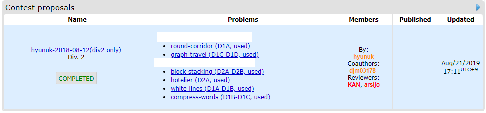
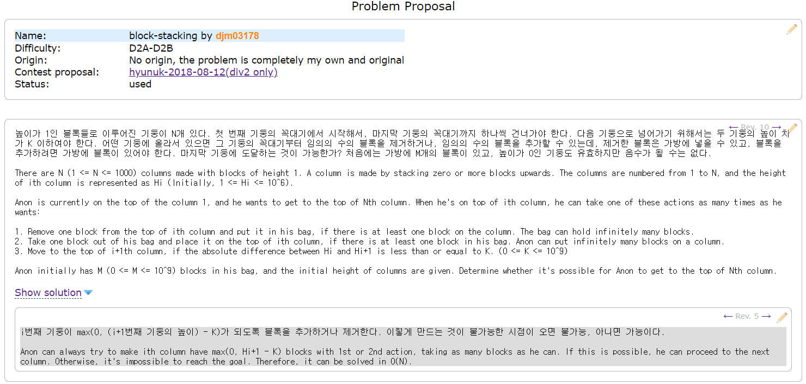

지난 8월 11일, 현재 세계 최대 규모의 사설 프로그래밍 대회 사이트인 [Codeforces](https://codeforces.com/)에서 [hyunuk](https://codeforces.com/profile/hyunuk) (aka. [jwvg0425](https://www.acmicpc.net/user/jwvg0425)) 님과 제가 공동 개최한 [Codeforces Round #578 (Div. 2)](https://codeforces.com/contest/1200)가 열렸습니다. 이전까지 소규모 대회 개최에 출제자나 검수자로 참여해보기는 했었으나, 백 명 내외가 참가했던 기존 대회들과는 달리 무려 만 명이 넘게[^1], 그것도 전세계에서 참가하는 대회였기에 본격적이었습니다.

이 글에서는 이 라운드가 개최되기까지의 전 과정을 돌이켜보고, 문제별로 간단한 솔루션과 함께 코멘트를 남겨보려고 합니다.

## 역사 ##
우선 대회가 처음 계획되었을 때부터 대회가 종료될 때까지의 주요 이벤트들을 시간순으로 적어보려고 합니다. 대회 준비의 전 과정을 간략하게 요약해서 볼 수 있습니다.

### 계획 및 Proposal 작성 ###
처음 코드포스 라운드 개최를 제안한 것은 hyunuk 님이었습니다. 8월 11일 [제2회 소프트콘](https://www.acmicpc.net/contest/view/324)이 끝난 직후, 바로 다음 대회를 코드포스에서 같이 준비해보지 않겠느냐는 제안을 주셨고 제가 수락하면서 대회를 만들기 시작했습니다.

가장 먼저 한 일은 대회의 proposal을 만드는 것입니다. 코드포스의 대회는 개최자가 마음대로 여는 것이 아니라, 코드포스의 coordinator들에게 출제할 문제들에 대한 개요를 적은 proposal을 보여주고, 대회로 만들기에 적합한 문제 세트라는 인정을 받아야 합니다. Coordinator들은 또한 문제들의 디스크립션, 솔루션, 데이터 등을 검토하고 러시아어로 번역할 뿐 아니라[^2], 테스터들을 모으고 완성된 문제들을 코드포스 플랫폼에 적용시켜 대회를 관리하고 출제자들과 함께 대회 중 질문에 답변하는 등 대회 전반에 걸쳐 운영을 이끌어주는 분들입니다.

Proposal은 문제의 아이디어와 의도된 풀이 정도만 제시하는 것이기 때문에, 형식적이지 않으며 엄밀한 제한도 설정하지 않아도 됩니다.

초기에는 hyunuk 님이 3문제, 제가 4문제를 기획하여 문제의 개요와 간단한 풀이를 작성하고 proposal을 열었습니다. 여기까지는 한 달 정도밖에 걸리지 않았고, 문제들도 괜찮았다고 생각했기 때문에 금방 대회 개최를 할 수 있을 것이라고 생각했으나...

### 기다림, 거절, 그리고 새로운 문제들 ###
그 당시 proposal이 많이 밀려 있던 상황이었기 때문에, coordinator의 연락은 아무리 기다려도 오지 않았습니다. 설상가상으로, 10월 13일에는 실수로 proposal을 닫는 버튼을 눌러 큐의 맨 뒤로 밀리기까지 하고 말았습니다.

그렇게 해가 넘어가고, 몇 달이 지나도 아무런 일이 일어나지 않아 이대로 묻히는 줄 알았던 저희에게 처음으로 coordinator로부터 연락이 온 것은 2019년 4월 15일이었습니다.

오랜 시간 기다려 온 저희가 받은 coordinator [KAN](https://codeforces.com/profile/KAN) 님의 첫 평가는 단호했습니다. 7문제 중 5문제가 너무 전형적이거나 이미 출제된 적이 있는 문제라는 이유로 거절되었습니다. 그 날 OK 사인을 받고 대회에 실제로 출제된 문제 2개는 [B. Block Adventure](https://codeforces.com/contest/1200/problem/B)와 [D. White Lines](https://codeforces.com/contest/1200/problem/D)입니다.

생각보다 까다로운 기준에 놀라기도 했지만, 드디어 라운드가 개최될 희망이 보인다는 것을 기뻐하며 새로운 문제들을 만들기 시작했습니다. 어려운 난이도의 문제들이 대부분 거절당했기에, 저희한테도 쉽지 않은 수준의 좋은 문제들을 다시 만드는 것은 쉬운 일은 아니었습니다.

약 한 달에 걸쳐 다시 6문제가 완성되고, 그 후 KAN 님이 다시 찾아오신 날은 6월 4일이었습니다.

### 문제 작성 ###
최상위 난이도가 다시 한 번 거절되었지만, 나머지 문제들에 대해 통과 신호를 받고 대회 구성을 시작해도 된다는 허락을 받았습니다. 이때 통과된 세 문제가 [A. Hotelier](https://codeforces.com/contest/1200/problem/A), [C. Round Corridor](https://codeforces.com/contest/1200/problem/C), 그리고 [E. Compress Words](https://codeforces.com/contest/1200/problem/E)입니다. 또한 KAN 님과의 보다 원활한 소통을 위해 Telegram을 사용하기 시작했습니다.

코드포스의 대회 문제들은 [Polygon](https://polygon.codeforces.com/)[^3]에서 제작하게 되어 있습니다. Polygon에서 작성한 문제를 코드포스가 직접 가져오는 형식으로 되어 있기 때문입니다. 이때부터 대회 개최 전까지는 틈 나는 대로 지문을 작성하고, 데이터를 생성하고, 다양한 솔루션 / 틀린 코드들을 만들었는데, 이에 대한 것은 아래에서 문제별로 다시 서술하겠습니다.

그 동안 최상위 문제도 두 개를 더 만들었고, 둘 다 괜찮다는 이야기를 들었지만 그 중 더 마음에 들었던 문제인 [F. Graph Traveler](https://codeforces.com/contest/1200/problem/F)를 마지막 문제로 하기로 결정했습니다.

7월 31일경에는 KAN 님이 여러 테스터 분들을 불러 대회 문제들을 모아놓은 비공개 gym을 만들고 테스트를 해주셨습니다. 얼마 후 저희가 직접 백준 온라인 저지에서 홍보를 통해 여러 테스터 분들을 더 모셨고, 많은 테스트를 통해 문제들이 한층 더 두터워지게 되었습니다.

8월 11일, 대회 당일에는 지문과 데이터를 마지막으로 점검하고, 에디토리얼을 작성했습니다.

그렇게 하여 정확히 1년간 준비해 온 코드포스 라운드를 개최하게 되었습니다.

### 대회 개최 ###
대회 당일에는 KAN 님이 바쁘셔서 대신 [arsijo](https://codeforces.com/profile/arsijo) 님이 봐주시게 되었습니다. 전날에서야 대회 내용을 보게 되신지라, 재빨리 문제들을 한 번씩 풀어보고 대회 세팅을 마무리 해주셨습니다. 대회 중 저희가 해야 할 일에 대한 설명을 듣고, 텔레그램 방에 모여서 대회 시작을 맞이했습니다.

대회 중에 출제자가 할 일은 질문에 답변하는 것이 거의 전부였습니다. 문제가 러시아어로도 번역되어 있기 때문에 간혹 러시아어 질문이 올라오기도 했는데, 그런 질문들은 arsijo 님이 답변을 대신 해주셨기 때문에 신경쓰지 않아도 괜찮았습니다. 총 116개에 달하는 질문들에 2시간 동안 답변을 했습니다.

[^1]: 공식 참가자 10742명, 비공식 참가자 321명, 합계 11063명
[^2]: 코드포스는 러시아 웹사이트이기 때문에, 코드포스에서 개최되는 라운드의 문제들은 기본적으로 모두 영어와 러시아어 버전을 모두 제공합니다.
[^3]: 꼭 코드포스 대회가 아니더라도 프로그래밍 문제를 체계적으로 작성하는 데에도 유용합니다. 자세한 사용법은 http://www.secmem.org/blog/2019/05/17/polygon-how-to-use/ 에서 볼 수 있습니다.
