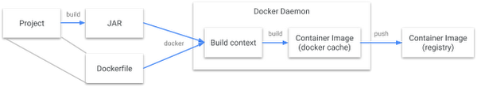
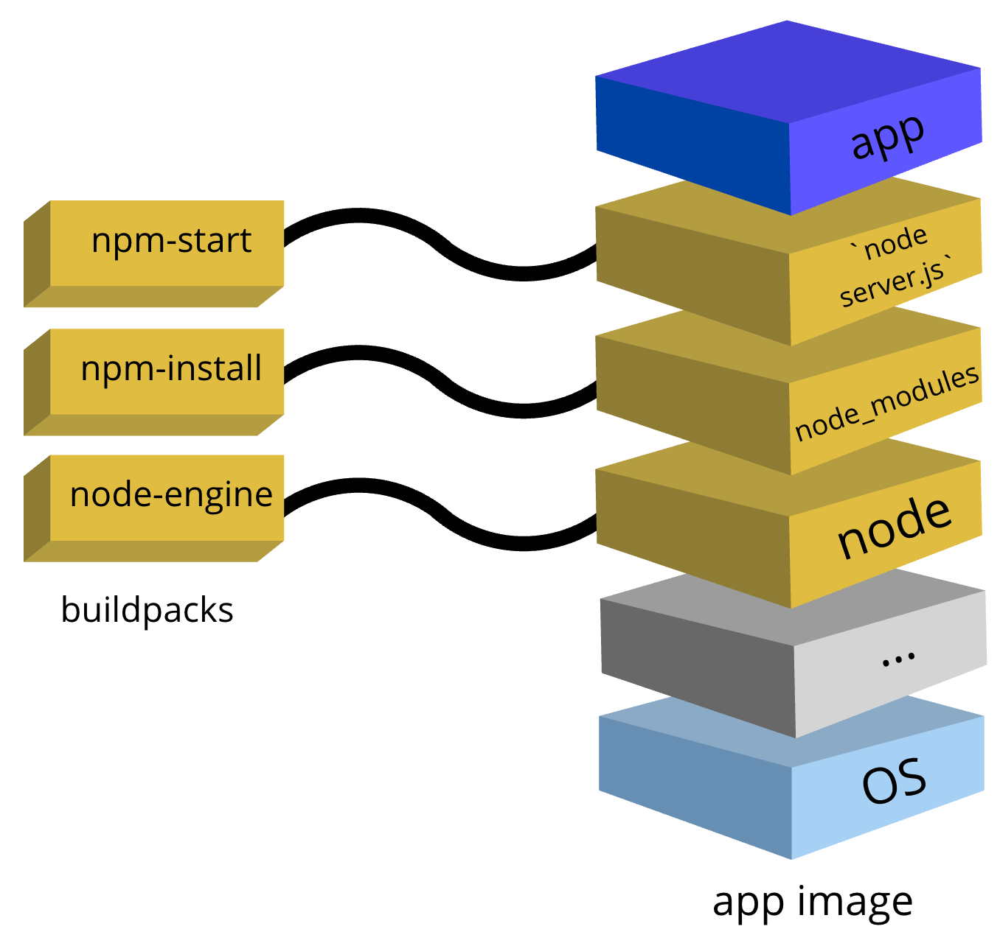

## 들어가며

Spring Boot 애플리케이션의 컨테이너 이미지화 방법을 살펴보고 그 방법들의 장단점을 알아보려 한다.

## 컨테이너 이미지화

### Dockerfile

```dockerfile
FROM azul/zulu-openjdk-centos:11
RUN mkdir -p /opt/spring-boot-app/logs
RUN touch /opt/spring-boot-app/logs/gc.log
ADD ./build/libs/spring-boot-app.jar /opt/spring-boot-app.jar
EXPOSE 8080
ENTRYPOINT ["java", "-jar", "/opt/spring-boot-app.jar"]
```

상당히 간단한 형태이다. 다만 보다시피 JAR 파일을 통째로 넣으므로 모든 빌드의 통째 결과가 새로운 레이어로 생성된다. 이는 즉 저장소의 용량을 더 많이 차지한다는 것이고, 새로운 버전의 시작 대기 시간도 더 많은 용량을 다운로드해야 하므로 더 길어짐을 의미한다.

그나마 다른 도구를 추가하기는 제일 쉽다. CentOS이므로 그냥 `RUN yum install -y xxx` 하면 패키지 설치 완료다.

빌드하고 AWS ECR Repository로 푸시하기 위한 명령은 다음과 같다.

```bash
./gradlew bootJar
docker build -t spring-boot-app:${DOCKER_TAG} . -f ${env.WORKSPACE}/Dockerfile
aws ecr get-login-password | docker login --username AWS --password-stdin 0123…
docker tag spring-boot-app:${DOCKER_TAG} 0123…/spring-boot-app:${DOCKER_TAG}
docker push 0123…/spring-boot-app:${DOCKER_TAG}
```

공식 블로그 글<sup>[#](http://spring.io/blog/2020/01/27/creating-docker-images-with-spring-boot-2-3-0-m1)</sup>에서 Layered Jars를 활용한 레이어 분리도 제시하고 있으나 아래 예시와 같이 상당히 복잡한 Dockerfile이 있어야 하고 이는 즉 유지보수가 어려워진다는 뜻이다. 테스트해보지조차 않았다.

```bash
FROM adoptopenjdk:11-jre-hotspot as builder
WORKDIR application
ARG JAR_FILE=target/*.jar
COPY ${JAR_FILE} application.jar
RUN java -Djarmode=layertools -jar application.jar extract

FROM adoptopenjdk:11-jre-hotspot
WORKDIR application
COPY --from=builder application/dependencies/ ./
COPY --from=builder application/snapshot-dependencies/ ./
COPY --from=builder application/resources/ ./
COPY --from=builder application/application/ ./
ENTRYPOINT ["java", "org.springframework.boot.loader.JarLauncher"]
```

### [Jib](http://github.com/GoogleContainerTools/jib)

Jib은 Docker daemon 없이도 컨테이너 이미지를 만들 수 있도록 도와주는 도구이다.



Dockerfile 문단에서 살펴보았던 빌드 과정이 위와 같다면 Jib를 사용하면 다음과 같아진다.


Gradle plugin으로 제공되며, DSL을 제공하여 간단하게 설정할 수 있다.

```groovy
jib {
   from {
      image = 'azul/zulu-openjdk-centos:11'
   }
   to {
      auth {
         username = 'AWS'
         try {
            password = 'aws ecr get-login-password'.execute().text.trim()
         } catch (ignored) {
         }
      }
   }
   container {
      creationTime = 'USE_CURRENT_TIMESTAMP'
      ports = ['8080']
      volumes = ['/opt']
   }
}
```

빌드 명령은 다음과 같다.

```bash
touch ./src/main/jib/opt/spring-boot-app/logs/gc.log
./gradlew jib --image 0123…/spring-boot-app:${DOCKER_TAG}
```

특장점은 4가지가 있다.

* Spring Boot 버전과 관계없이 Gradle 5.1 이상이면 사용할 수 있다.
* Docker daemon이 필요하지 않아 Windows에서 사용하기 편리하다.
* 재현할 수 있는 빌드를 위해 `creationTime`을 Unix epoch로 기본 설정하게 되어 있는데, 크게 필요하지는 않은 기능이고 주기적 삭제 등에 불편한 점이 있어 현재 시각으로 설정하도록 변경했다.
* 레이어는 다음과 같이 5개로 나뉜다.
  * Base image
  * Dependencies: 의존하는 JAR 파일들이다. 일반적으로 가장 용량이 크다. 이는 즉 의존성 업데이트가 일어나지 않으면 이 레이어가 계속 재사용됨을 의미한다.
  * Resources: 함께 배포하는 리소스 파일들이다. 서버에서 프론트엔드 SPA 파일들을 함께 내려준다면 그 용량이 모두 포함되기는 한다. 프론트엔드를 CDN에 태운다면 상당히 작을 수 있다.
  * Classes: 소스 코드가 컴파일된 class 파일들이다.
  * Additional files: 위 gc.log 같은 임의의 추가 경로 파일이다. src/main/jib 아래의 경로를 루트로부터 따라간다.

### [bootBuildImage](http://docs.spring.io/spring-boot/docs/2.7.x/gradle-plugin/reference/htmlsingle/#build-image)

* Spring Boot 2.3: [Build OCI images with Cloud Native Buildpacks](http://github.com/spring-projects/spring-boot/wiki/Spring-Boot-2.3-Release-Notes#build-oci-images-with-cloud-native-buildpacks)
* Spring Boot 2.4: [Layered jar enabled by default](http://github.com/spring-projects/spring-boot/wiki/Spring-Boot-2.4-Release-Notes#layered-jar-enabled-by-default)
* Spring Boot 2.5: [Custom Buildpacks](http://github.com/spring-projects/spring-boot/wiki/Spring-Boot-2.5-Release-Notes#custom-buildpacks)

Spring Boot 버전이 하나씩 올라갈 때마다 발전해온 컨테이너 이미지화 방법이다.

```groovy
bootBuildImage {
	runImage = 'paketobuildpacks/run:full-cnb'
	imageName = "${project.name}:latest"
	buildpacks = ['gcr.io/paketo-buildpacks/azul-zulu:latest', 'paketo-buildpacks/java']
}
```

물론 다시 Docker daemon을 사용하므로 푸시는 직접 해줘야 한다.

```bash
./gradlew bootBuildImage
aws ecr get-login-password | docker login --username AWS --password-stdin 0123…
docker tag spring-boot-app:latest 0123…/spring-boot-app:${DOCKER_TAG}
docker push 0123…/spring-boot-app:${DOCKER_TAG}
```

특장점은 다음과 같다.

* Java 버전을 명시할 필요가 없다. Gradle의 Java Toolchain 기능을 사용했다면 java buildpack에 의해 적절한 버전의 JDK가 선택된다.
* JDK vendor도 위와 같이 Azul Zulu로 쉽게 변경할 수 있다. 기본은 BellSoft Liberica이다.

### 비교 표

|                               | Dockerfile                                 | Jib                                                 | bootBuildImage                                    |
| ----------------------------- | ------------------------------------------ | --------------------------------------------------- | ------------------------------------------------- |
| 코드 관련 필요 사항           | -                                          | Gradle 5.1+                                         | Spring Boot 2.3+<br>(Gradle 5.6.x 또는 6.3+ 필요) |
| Docker runtime 필요 여부      | O                                          | X                                                   | O                                                 |
| 다중 레이어 지원 여부         | △<br>다만 JAR를 직접 쪼개고 잘 배치해야 함 | O                                                   | O                                                 |
| 타 도구 설치 등의 확장 가능성 | O<br>빌드 단계에서 명령 하나로 추가 가능   | △<br>플러그인 활용 필요하지만 쓸만한 것이 별로 없음 | O<br>Spring Boot 2.5+, Buildpack 활용 필요        |

## Needs: 패키지 설치 필요성

Apache POI SXSSF 등 특정 상황에서 컨테이너 이미지 안에 일부 패키지(e.g., fontconfig)가 필요한 상황이 생겼다. 이를 해결하기 위한 방법을 생각해보자.

* Dockerfile: 언급하였듯이 `RUN`으로 임의의 명령을 실행할 수 있기에 기존 OS에서 설치하듯이 해주면 된다.
* Base image 변경: 위에서 나온 azul/zulu-openjdk-centos:11 등에 필요한 패키지를 넣어둔 상태의 이미지를 만들고 이를 추후 이용하는 방법도 가능은 하다. 다만 이 이미지는 고정된 것이 아니라 취약점 대응 등 꽤 빈번하게 업데이트되므로 이에 맞추어 자체 이미지를 매번 갱신하기는 번거롭다.
* Buildpack: 표에서 언급한 Buildpack을 활용하면 이미지를 맞춤화할 수 있다. 예시에서 JDK vendor를 BellSoft Liberica에서 Azul Zulu로 변경한 것도 Buildpack을 통해서이다. 다음 문단에서 살펴본다.

## Paketo Buildpacks

Buildpack은 컨테이너 이미지를 만들기 위해 필요한 단계들을 감지하고 각 레이어를 '기여'하는 방식으로 작동한다.


예를 들어 Node.js 애플리케이션을 개발했다고 하면 이 런타임도 필요하고, node_modules 내용도 채워야 하고, 실제 기동을 위해 `node server.js`와 같은 진입점 설정도 필요하다. 이를 다음과 같이 해준다.



Java의 경우 기존 메모리 모델이 컨테이너 환경을 고려하지 않고 만들어져 처음에 설정하는 데에 어려움을 겪는 경우가 많은데, 이를 휴리스틱 기반 권장값으로 설정해주므로 편하게 사용할 수 있다.

## [apt Buildpack](http://github.com/fagiani/apt-buildpack)

공식적으로 제공되는 Buildpack은 아니고 개인이 만든 것이다. Debian 계열 OS를 활용하므로 apt를 통해 패키지를 설치할 때 활용할 수 있다.

Buildpack들을 활용해 컨테이너 이미지를 만들 때 기여하는 레이어는 파일과 환경 변수의 제공만 가능하다. 그렇다면 이 Buildpack은 어떻게 작용하는 것일까? 바로 builder 내에서는 apt를 실제로 실행하지만, 여기서 나온 파일들만 레이어로 기여하고 이 경로를 PATH에 추가하는 형태로 이루어진다.

v0.2.5 기준 제일 핵심적인 부분은 아래와 같다. apt로 다운로드한 deb 파일이 기록되는 장소를 변경했고, 기존 /lib/x86_64-linux-gnu, /lib/i386-linux-gnu, /lib, /usr/lib/x86_64-linux-gnu, /usr/lib/i386-linux-gnu, /usr/lib 등에 설치되는 파일을 앞에 레이어의 경로명을 추가하여 PATH에 잡아주는 것을 볼 수 있다.

```bash
APT_OPTIONS="-o debug::nolocking=true -o dir::cache=$APT_CACHE_DIR -o dir::state=$APT_STATE_DIR"
APT_OPTIONS="$APT_OPTIONS -o dir::etc::sourcelist=$APT_SOURCES -o dir::etc::sourceparts=/dev/null"

ld_library_path=$apt_layer/lib/x86_64-linux-gnu:$apt_layer/lib/i386-linux-gnu:$apt_layer/lib:$apt_layer/usr/lib/x86_64-linux-gnu:$apt_layer/usr/lib/i386-linux-gnu:$apt_layer/usr/lib

echo -n "$ld_library_path" > $apt_env_dir/LD_LIBRARY_PATH.prepend
echo -n ":" > $apt_env_dir/LD_LIBRARY_PATH.delim
```

사용하기 위해서는 이 Buildpack에서 Aptfile을 얻어올 수 있어야 하므로 복사해주어야 한다. 주의사항으로는 Windows에서 사용해볼 경우 Aptfile의 개행문자가 CRLF가 아닌 LF가 맞는지 확인해야 한다.

```groovy
bootJar {
    from 'Aptfile'
}

bootBuildImage {
    buildpacks = ['ghcr.io/fagiani/buildpacks/fagiani_apt:0.2.5', …]
}
```

이 Buildpack을 변경해가며 테스트해보고 싶다면 다음과 같이 로컬에서 가져와서 실행하도록 설정할 수 있다.

```groovy
tasks.register('makeBuildpack', Tar) {
    into('/') {
        from 'apt-buildpack'
    }

    archiveFileName.set('apt-buildpack.tgz')
    compression Compression.GZIP
    fileMode 0755
}

bootBuildImage {
    dependsOn makeBuildpack
    buildpacks = ["${rootProject.rootDir}/build/distributions/apt-buildpack.tgz", …]
}
```

예를 들어 apt 다운로드 속도를 높이기 위해 위 `APT_OPTIONS` 설정하는 부분에 다음과 같은 내용을 넣고,

```bash
if [[ $BP_APT_REPOSITORY ]]; then
  topic "Override default repositories"
  sed -i -E "s/(archive|security)\.ubuntu\.com/$BP_APT_REPOSITORY/" $APT_SOURCES
fi
```

호출할 때 다음과 같이 설정해줄 수 있다.

```groovy
bootBuildImage {
    environment = [
            'BP_APT_REPOSITORY': 'mirror.kakao.com',
    ]
}
```

## 폰트 사용법

Aptfile로 다음 패키지들을 설치한다.

```
fontconfig
fonts-baekmuk
```

실행할 때 환경 변수가 필요하다면 'BPE_' 접미사를 넣어 설정해줄 수 있다. fontconfig의 실행에는 총 3가지의 환경 변수가 필요하다.

```groovy
bootBuildImage {
    environment = [
            'BPE_FONTCONFIG_PATH': '/layers/fagiani_apt/apt/etc/fonts',
            'BPE_XDG_DATA_HOME': '/layers/fagiani_apt/apt/usr/share',
            'BPE_XDG_CACHE_HOME': '/layers/fagiani_apt/apt/usr/share',
    ]
}
```

다음과 같은 명령으로 잘 설치되었는지 확인해볼 수 있다. 진입점이 이미 설정되어 있어 이를 바꿔주어야 한다.

```bash
docker run --rm --entrypoint launcher -it spring-boot-app:latest fc-list
```

> Setting Active Processor Count to 12
> Calculating JVM memory based on 14999144K available memory
> For more information on this calculation, see https://paketo.io/docs/reference/java-reference/#memory-calculator
> Calculated JVM Memory Configuration: -XX:MaxDirectMemorySize=10M -Xmx14625607K -XX:MaxMetaspaceSize=66336K -XX:ReservedC
> odeCacheSize=240M -Xss1M (Total Memory: 14999144K, Thread Count: 50, Loaded Class Count: 9298, Headroom: 0%)
> Enabling Java Native Memory Tracking
> Adding 124 container CA certificates to JVM truststore
> Spring Cloud Bindings Enabled
> /layers/fagiani_apt/apt/usr/share/fonts/truetype/dejavu/DejaVuSerif.ttf: DejaVu Serif:style=Book
> /layers/fagiani_apt/apt/usr/share/fonts/truetype/dejavu/DejaVuSansMono.ttf: DejaVu Sans Mono:style=Book
> /layers/fagiani_apt/apt/usr/share/fonts/truetype/baekmuk/hline.ttf: Baekmuk Headline,백묵 헤드라인:style=Regular
> /layers/fagiani_apt/apt/usr/share/fonts/truetype/dejavu/DejaVuSans.ttf: DejaVu Sans:style=Book
> /layers/fagiani_apt/apt/usr/share/fonts/truetype/baekmuk/dotum.ttf: Baekmuk Dotum,백묵 돋움:style=Regular
> /layers/fagiani_apt/apt/usr/share/fonts/truetype/dejavu/DejaVuSerif-Bold.ttf: DejaVu Serif:style=Bold
> /layers/fagiani_apt/apt/usr/share/fonts/truetype/baekmuk/gulim.ttf: Baekmuk Gulim,백묵 굴림:style=Regular
> /layers/fagiani_apt/apt/usr/share/fonts/truetype/baekmuk/batang.ttf: Baekmuk Batang,백묵 바탕:style=Regular
> /layers/fagiani_apt/apt/usr/share/fonts/truetype/dejavu/DejaVuSans-Bold.ttf: DejaVu Sans:style=Bold
> /layers/fagiani_apt/apt/usr/share/fonts/truetype/dejavu/DejaVuSansMono-Bold.ttf: DejaVu Sans Mono:style=Bold

Spring Boot 애플리케이션 위에서 명령을 실행하기에 관련 로그들이 먼저 나오고 나서 fc-list 명령의 실행 결과가 나온다.

## 나오며

이상으로 Spring Boot 애플리케이션을 컨테이너 이미지로 잘 만드는 방법에 대해 알아보았다. Dockerfile을 관리하는 것 이외에도 레이어를 재사용하는 방법이 있음을 알았다.
