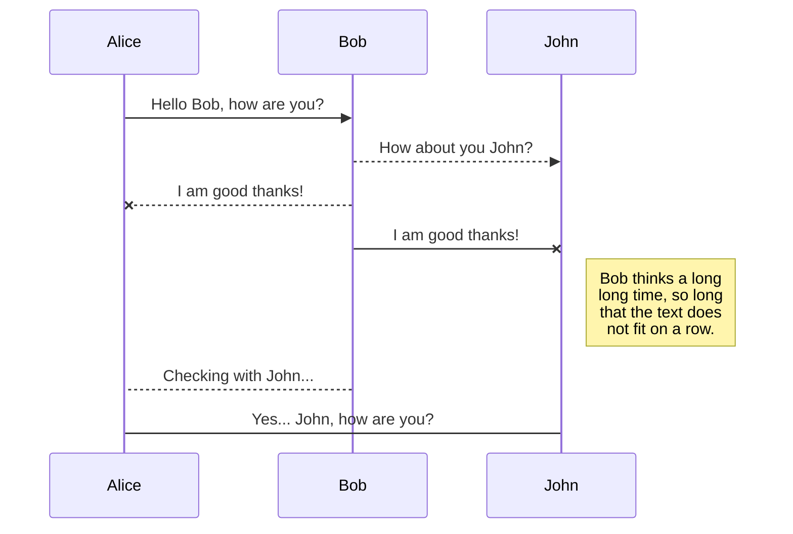
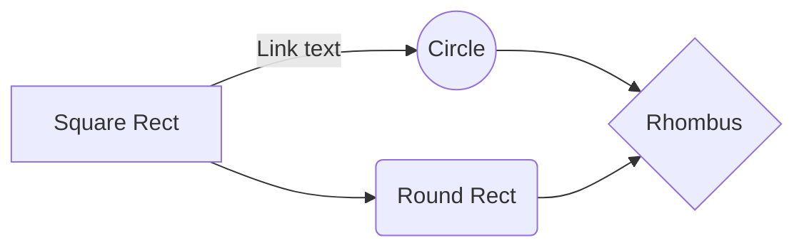

# 서론

 양자컴퓨팅에는 다양한 양자 알고리즘이 존재한다. 하지만 양자컴퓨터의 결과를 해석하는 법은 computational basis를 기준으로 한 "측정" 뿐이다. Grover algorithm이나 Quantum Phase Estimation 알고리즘 등의 알고리즘은 결과 큐빗이 0인지 1인지 관측하는 것 만으로 충분하다.
 
하지만 임의의 n-qubit 양자상태는 $2^n \times 2^n$ 복소 행렬로 표현된다. 이 때문에 측정을 기반으로 하여 원래의 상태 행렬 자체를 알아내는 것 또한 활발하게 연구되었다. 이를 **Quantum State Tomography**라고 한다.

> 이 글은 양자역학에서 state를 density matrix로 어떻게 표현하는지, 관측을 어떻게 수학적으로 기술하는지에 대한 기본적인 개념에 대한 설명을 생략하였다. 만약 해당 내용을 모른다면 먼저 공부하고 읽는 것을 추천한다.

# Linear Inversion

관측값을 기반으로 양자 상태를 추정하는 것은 중요하다. 하지만 Quantum state tomography는 이미 그들의 이론적인 한계에 거의 근접하여 최적의 방식이 나와 있다. 그 방식은 측정 횟수가 큐비트 수에 지수적으로 증가하여 n=20만 되어도 거의 실현 불가능할 정도이다. 구체적으로는, d*d density matrix를 알기 위해서는 $rank(\rho)d$ 번의 측정이 필요하다. 게다가, 측정은 양자상태를 파괴하므로 기하급수적인 copies가 필요하다. 이를 피하기 위해 다항 개수의 copy만을 필요로 하는 matrix product state(MPS) QST, neural network tomography가 연구되었지만, 이또한 일반적인 경우에는 기하급수적인 copy가 필요하다.

> Aaronson[5]는 전체 양자상태가 아닌 observable의 기댓값을 구하는것은 적은 copy만으로 가능함을 보였다. 하지만 실제 하드웨어적인 구현이 어렵다. 또한 그 값을 저장할 메모리 또한 부족하다.

해당 논문에서는 미지 양자 상태 전체를 알아내는것이 아닌 특정 속성만을 알아내는 shadow tomography와 동일한 목표를 가지고 있다. 우리는 미지의 양자상태 $\rho$로부터 최소한의 고전적인 스케치인 $S_\rho$(classical shadow)를 구성하여 다양한 속성을 예측하는데 사용한다.

 방식은 간단하다. 랜덤한 유니터리 변환을 가하여 $\rho$ -> $U\rho U^\dagger$ 로 바꾸고, 모든 큐비트를 측정한다. 여기서 반복 횟수가 classical shadow의 크기가 된다. log(M)크기만으로  M개의 $tr(O_i \rho)$를 계산할 수 있다.

## Procedure: classical shadow

1. 미지의 양자상태 $\rho$에 랜덤한 유니터리 변환을 가하여 $\rho$ -> $U\rho U^\dagger$ 로 바꾼다.

2. n큐빗을 전부 측정하여 $\ket{\hat b}$ 를 구한다. 이후 효율적인 고전 메모리에 $U^\dagger \ket{\hat b}\bra{\hat b} U$를 저장한다.

3. 이제 $\rho$에서 $U^\dagger \ket{\hat b}\bra{\hat b} U$의 기댓값으로 매핑하는 양자 채널을 생각해 볼 수 있다. $ M(\rho) = E[U^\dagger \ket{\hat b}\bra{\hat b} U]$

4. 해당 양자 채널은 랜덤한 유니터리 연산자를 뽑을 모집단에 관련되어 있다. **$M^{-1}$ 은 CP한 배열이 아니므로 실제 구현은 불가능하지만 수치적인 계산은 가능하다.** 첨언하자면, M이 CP일 조건은 유니터리 연산자의 앙상블이 tomographically complete하면 된다.

5. 이제 해당 변환의 역변환을 가하여 *single classical snapshot*을 얻어낼 수 있다.   $\hat\rho = E[M^{-1}(U^\dagger \ket{\hat b}\bra{\hat b})]$ 이렇게 얻어낸 스냅샷은 기댓값이 $\rho$이다.

6. 위 과정을 N번 반복하면 ***classical snapshots of $\rho$*** 를 얻는다.   $S(\rho ; N) = \{ \hat{\rho _{1}}, \hat{\rho _{2}}, ... , \hat{\rho _{N}}\}$ 앞으로 이 집합을 ***classical shadow of $\rho$*** 라고 부르며 다양한 속성을 추정하는데 사용할 것이다.

이상치를 배제하기 위해 동일한 크기의 chunks들로 나누어 각각의 평균을 구한 뒤 중앙값을 구할것이다. 이 방식을 ***median of means estimation*** 이라 부르자. 여기서 거대한 행렬인 $\hat\rho$를 직접 계산하지 않아도 된다.

양자 채널 $M$은 (1)번 프로세스에서 랜덤 선택할 유니터리 변환의 집합에 따라 달라진다. 아래 두가지 후보가 있다.
1. random n-qubit Clifford circuits

2. single Clifford circuits의 tensor products

   이 경우에 역변환은 각각의 Clifford circuits의 역변환의 텐서곱이다.

## median of means prediction algorithm

1. 미지의 양자상태 $\rho$에 랜덤한 유니터리 변환을 가하여 $\rho$ -> $U\rho U^\dagger$ 로 바꾼다.

# Numerical experiments

classical shadows의 장점은 **확장성**이다. 데이터 수집 단계는 Pauli measurements기반이라 최신 플랫폼들에서 실행 가능하다. 또한 Clifford measurements를 사용하면 미래의 양자컴퓨터 플랫폼에서도 실행 가능하다. 각 경우 모두 classical shadow는 **고전 메모리**에 쉽게 저장 가능하다. 확장성 덕분에 최대 160큐빗까지 시뮬레이션 가능하며, 심지어 bottleneck은 데이터 생성에서 만든다. **즉, 실제로 양자컴퓨터로 구현한다면 큐비트 수 제한이 없다.**

저자는 *합성 데이터*를 사용하여 $\rho$에 대한 고전 표현을 알아내고, 다양한 속성을 알아내는데 사용한다.

가장 좋은 것은 머신러닝을 기반으로한 접근이다. *Neural Network Quantum State Tomography(NNQST)* 는 양자상태의 측정결과(POVM)를 입력으로 받고 양자상태를 생성해내는 모델이다. 한번 양자상태의 고전적 표현값들을 이용해 양자상태의 다양한 속성들을 예측하는 것의 장점을 classical shadow와 NNQST기반 방법을 비교해보자.

## stabilizer state란?

수학적으로 n qubit state $\phi$ 가 stabilizer state라는 뜻은 Pauli group안에서 크기 $\phi$를 고윳값1인 고유벡터로 가지는 $2^n$인 matrix 집합이 존재함을 의미한다. 예를들어 $(|00>+|11>)/\sqrt 2$ 는 크기 4인 ${II, XX, -YY, ZZ}$ 집합이 존재하므로 stabilizer state이다.

stabilizer state는 |00..0> 부터 시작하여 Clifford gates만 사용하여 도달 가능한 상태들이며 *Gottesman–Knill theorem*에 의해 고전 컴퓨터로도 다항 시간에 효과적으로 시뮬레이션 가능하다. 논문에서 classical shadow 알고리즘을 구동하는데 지배적인 과정은 $<\hat b|UOU^{\dagger}|\hat b>$를 계산하는 것인데 이게 $O(n^2)$에 계산 가능하다고 한다.

## Direct fidelity estimation이란?

single pure state target $\rho$에 대해 $\braket{\psi|\rho|\psi}$를 허용오차 $\epsilon$이내로 구하는 것이다. 타겟의 조건에 따라 $1/\epsilon^2$(stabilizer state)부터 $2^n/\epsilon^4$ 까지 다양한 측정횟수가 요구된다.

## Predicting quantum fidelities via Clifford measurements

GHZ states의 fidelity를 NNQST기법과 classical shadow기법 두가지로 각각 계산하여 비교할 것이다. 이때 GHZ state에 에러확률 p를 섞어서 만든 상태를 가지고 p를 증가시켜 가며 fidelity를 감소시키면서 추정할 것이다. Fig 2의 오른쪽 사진에서 p=1로 간다면 원래 상태와 완전히 수직하므로 fidelity가 0이 되어야 하나 NNQST기법은 그 값을 참값보다 크게 추정하며 오히려 1에 가까웠다. 그 이유는 NNQST기반의 방식이 Upper bound를 추정하는데 효율적인 기법이기 때문이라고 한다(p4). 정확한 값을 구하려면 어마어마하게 많은 수의 측정이 필요하다. 반면 classical shadow기반 방법은 n이 증가하여도 측정 횟수는 거의 일정하면서도 fidelity는 정확하게 추정하였다.

<b>Fig 2. Predicting quantum fidelities using classical shadows (Clifford measurements) and NNQST. a</b>

 

## Predicting two-point correlation and subsystem entanglement entropy (Pauli measurements).

Clifford measurements기반으로 한 classical shadow는 quantum state fidelities를 효율적으로 알아낸 것을 확인하였다. 하지만 Clifford gate를 구현하는데 많은 얽힘 게이트가 들어가기 때문에 구현하는데 어려움이 있다. 이제는 구현하기 쉬운 local Pauli measurements기반의 classical shadow를 알아볼 것이다. 논문에서는 random Pauli measurements기반의 classical shadow가 **two-point correlation function**와 **subsystem entanglement entropy**같은 few-body properties를 예측하는데 효율적이라는 것을 보인다.

*Two point correlation functions*는 NNQST로 이미 효율적으로 계산할 수 있음이 밝혀져 있다[3].

먼저 **two-point correlation**의 경우이다. 목표는 Heisenberg model의 2차원 헤밀토니안 행렬을 구하는 것이다.

<b>Fig. 3 | Predicting two-point correlation functions using classical shadows (Pauli measurements) and NNQST. a</b>

이미지 아래쪽의 2D Heisenberg model을 보면 NNQST가 좀더 에러가 큰 것을 확인할 수 있다. 그림 아래쪽에 참값에는 없는 값의 요동이 있다. classical shadow가 더 정확하게 추정하는 것을 확인 가능하다. NNQST와 classical shadow모두 같은 측정값을 사용했으며, 각각의 프로세스로 처리한 방식만 다를 뿐이다. Fig 3의 오른쪽 위 이미지를 보면 classical shadow를 사용한 방식이 10000배쯤 빨랐다.

그다음은 **Subsystem entanglement entropies**에 적용하였다. 이 값은 classical shadow 기법으로 추정 가능한 중요한 비선형 함수이다. 요구되는 측정 횟수는 subsystem size에 지수적으로 증가한다. 하지만 전체 상태의 qubit수와는 무관하다. subsystem entanglement entropiese를 추정하는 일은 [20]에서도 독창적인 방법으로 연구되었으며, second-order Rényi entanglement entropies를 구하였다. 랜덤한 유니터리 회전을 적용하여 예측하였는데, 이는 classical shadow와 유사한 방식이다. 이 방식(Brydges et al. protocol)과 classical shadow의 결과를 비교할 것이다. Fig 4에서는 크기 2이하인 모든 subsystem의 entanglement entropy를 2500번 이하의 측정으로 예측하였다.

 classical shadow기법과 Brydges et al의 방식 모두 random single-qubit rotations와 basis measurements를 사용하여 고전 측정값을 뽑아내었으나 후처리 방식에서 차이가 난다. 이러한 작은 시스템에서 classical shadow가 에러가 더 작음을 보였다. GHZ state에서 n=4, 6, 8, 10일때 왼쪽 n/2만큼의 subentropy를 구하였으며 그 에러를 4b에서 비교할 수 있다. classical shadow의 에러가 더 낮음을 확인할 수 있다. 따라서 일정 에러 이하로 구하기 위해서 필요한 측정 횟수도 더 작다.

<b>Fig. 4 | Predicting entanglement Rényi entropies using classical shadows (Pauli measurements) and the Brydges et al. protocol. a</b>

## Application to quantum simulation of the lattice Schwinger model (Pauli measurements).

Pauli measurements기반이므로 현재의 양자 플랫폼에서도 구현 가능하다. 자세한 내용은 나중에 추가...

 

# 결론

classical shadow는 양자상태의 유용한 정보들을 적은 copy만으로도 뽑아낼 수 있는 간결한 요약본이다. 또한 Pauli measurements를 기반으로한 classical shadow는 현재 양자 플랫폼에서도 구현 가능하며 금방 다른 프로젝트에도 응용될 수 있을 것이다. 그리고 더 연구할만한 것들도 남아있다.

   - 만약 양자상태가 시간에 따라 바뀌는 경우 classical shadow를 어떻게 빠르게 업데이트 할 수 있을까?
   - classical shadows를 이용하여 양자 상태의 속성이 아닌 양자 채널의 속성을 알아낼 수는 없을까?
   - Clifford도, Pauli도 아닌 shallow random quantum circuits를 이용해서도 가능할까?
   - 더 일반화하여서 n개의 입자로 이루어진 양자 상태를 간결한 고전 데이터로 매핑하는 다른 방법은 없을까?
   - classical shadows를 이용해 머신러닝 돌린다면 quantum many-body 문제를 해결하는데 도움이 되지 않을까? 

## Rename a file

You can rename the current file by clicking the file name in the navigation bar or by clicking the **Rename** button in the file explorer.

## Delete a file

You can delete the current file by clicking the **Remove** button in the file explorer. The file will be moved into the **Trash** folder and automatically deleted after 7 days of inactivity.

## Export a file

You can export the current file by clicking **Export to disk** in the menu. You can choose to export the file as plain Markdown, as HTML using a Handlebars template or as a PDF.

# Synchronization

Synchronization is one of the biggest features of StackEdit. It enables you to synchronize any file in your workspace with other files stored in your **Google Drive**, your **Dropbox** and your **GitHub** accounts. This allows you to keep writing on other devices, collaborate with people you share the file with, integrate easily into your workflow... The synchronization mechanism takes place every minute in the background, downloading, merging, and uploading file modifications.

There are two types of synchronization and they can complement each other:

- The workspace synchronization will sync all your files, folders and settings automatically. This will allow you to fetch your workspace on any other device.
	> To start syncing your workspace, just sign in with Google in the menu.

- The file synchronization will keep one file of the workspace synced with one or multiple files in **Google Drive**, **Dropbox** or **GitHub**.
	> Before starting to sync files, you must link an account in the **Synchronize** sub-menu.

  >ㅇㄻㄴㅇㄹ

## Open a file

You can open a file from **Google Drive**, **Dropbox** or **GitHub** by opening the **Synchronize** sub-menu and clicking **Open from**. Once opened in the workspace, any modification in the file will be automatically synced.

## Save a file

You can save any file of the workspace to **Google Drive**, **Dropbox** or **GitHub** by opening the **Synchronize** sub-menu and clicking **Save on**. Even if a file in the workspace is already synced, you can save it to another location. StackEdit can sync one file with multiple locations and accounts.

## Synchronize a file

Once your file is linked to a synchronized location, StackEdit will periodically synchronize it by downloading/uploading any modification. A merge will be performed if necessary and conflicts will be resolved.

If you just have modified your file and you want to force syncing, click the **Synchronize now** button in the navigation bar.

> **Note:** The **Synchronize now** button is disabled if you have no file to synchronize.

## Manage file synchronization

Since one file can be synced with multiple locations, you can list and manage synchronized locations by clicking **File synchronization** in the **Synchronize** sub-menu. This allows you to list and remove synchronized locations that are linked to your file.

# Publication

Publishing in StackEdit makes it simple for you to publish online your files. Once you're happy with a file, you can publish it to different hosting platforms like **Blogger**, **Dropbox**, **Gist**, **GitHub**, **Google Drive**, **WordPress** and **Zendesk**. With [Handlebars templates](http://handlebarsjs.com/), you have full control over what you export.

> Before starting to publish, you must link an account in the **Publish** sub-menu.

## Publish a File

You can publish your file by opening the **Publish** sub-menu and by clicking **Publish to**. For some locations, you can choose between the following formats:

- Markdown: publish the Markdown text on a website that can interpret it (**GitHub** for instance),
- HTML: publish the file converted to HTML via a Handlebars template (on a blog for example).

## Update a publication

After publishing, StackEdit keeps your file linked to that publication which makes it easy for you to re-publish it. Once you have modified your file and you want to update your publication, click on the **Publish now** button in the navigation bar.

> **Note:** The **Publish now** button is disabled if your file has not been published yet.

## Manage file publication

Since one file can be published to multiple locations, you can list and manage publish locations by clicking **File publication** in the **Publish** sub-menu. This allows you to list and remove publication locations that are linked to your file.

# Markdown extensions

StackEdit extends the standard Markdown syntax by adding extra **Markdown extensions**, providing you with some nice features.

> **ProTip:** You can disable any **Markdown extension** in the **File properties** dialog.

## SmartyPants

SmartyPants converts ASCII punctuation characters into "smart" typographic punctuation HTML entities. For example:

|                |ASCII                          |HTML                         |
|----------------|-------------------------------|-----------------------------|
|Single backticks|`'Isn't this fun?'`            |'Isn't this fun?'            |
|Quotes          |`"Isn't this fun?"`            |"Isn't this fun?"            |
|Dashes          |`-- is en-dash, --- is em-dash`|-- is en-dash, --- is em-dash|

## KaTeX

You can render LaTeX mathematical expressions using [KaTeX](https://khan.github.io/KaTeX/):

The *Gamma function* satisfying $\Gamma(n) = (n-1)!\quad\forall n\in\mathbb N$ is via the Euler integral

$$
\Gamma(z) = \int_0^\infty t^{z-1}e^{-t}dt\,.
$$

> You can find more information about **LaTeX** mathematical expressions [here](http://meta.math.stackexchange.com/questions/5020/mathjax-basic-tutorial-and-quick-reference).

## UML diagrams

You can render UML diagrams using [Mermaid](https://mermaidjs.github.io/). For example, this will produce a sequence diagram:

And this will produce a flow chart:

